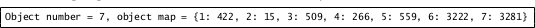

PDF/XMP
============

PDF/XMP v1 02 Avril 2015

by Ivance Kevin

Professor : Bertrand Frédéric

- [Introduction](#introduction)
- [ExtractionInformationPDF](#extractionInformationpdf)

## Introduction

Nous utilisons le langage **Python** à travers le package **re** (regular expressions), qui nous permet d'utiliser des expressions régulières pour **extraire** les métadonnées des documents PDF.
On utilisera également la bibliothèque [RDFlib](https://github.com/RDFLib/rdflib) pour interroger des données RDF.
- **Un ensemble de fichiers PDF** nous ont été fournit pour tester cela.

## ExtractionInformationPDF

Cette étape va nous permettre d'obtenir les informations structurelle du document PDF :

	- Le nombre d'ojets dans le document.

	- Pour chaque objets : 

			- adressse (offset)

Nous avons rangé ces informations dans un **dictionnaire** dont la **clé** sera le numéro de l'objets et la **valeur** son adresse.

Exemple, pour le document articleCISP2008.pdf on doit obtenir :



Ova récupérer l’adresse de début (startxref) de la table des références croisées et ensuite on va parcourir cette table pour en extraire des informations sur les objets en cours d’utilisation (cf. cours).
On utilisera des expression régulières.

Fichier exo1.py :
	```

	file_content=""

	fname = "/home/elbino/Workspace/Python/tdtp03/rdflib/src/pdf/test_articleCISP2008.pdf"

	#Transformatation du fichier PDF en flux de caractères

	with open(fname,"rb") as f :

		file_buffer = f.read();

	for byte in file_buffer:

		file_content += chr(ord(byte))

	#print file_content #Affiche le contenu du fichier pdf en format spécifique pdf

	motif = re.compile('(?<=startxref\s)[\d]+(?=\s%%EOF$)')

	recherche = motif.search(file_content)

	if recherche is not None :

		obj = int (recherche.group())

	motif2 = re.compile('[0-9]{10}\s[0-9]{5}\s[n]')

	recherche = motif2.findall(file_content[obj:])

	i=0

	map = {}

	for liste in recherche:

	    liste=liste.split(' ', 1 )

	    num=int(liste[0])

	    map[i+1] = num

	    i+=1

	number = len(map)

	print map;

	```

- On récupère le fichier test **test_articleCISP2008**.

- On convertit le fichier PDF en en flux de cartères.

- On utilise l'expression régulière **'(?<=startxref\s)[\d]+(?=\s%%EOF$)'** qui regarde dans le fichier pdf si il existe une valeur décimal entre startxref et %%EOF. Si c'est le cas on récupère cette valeur

Dans notre exemple, on affiche l'adresse de début de la lecteur de la table: **342**.


